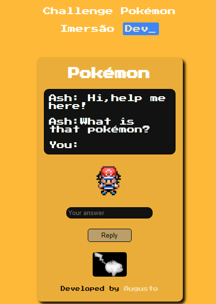
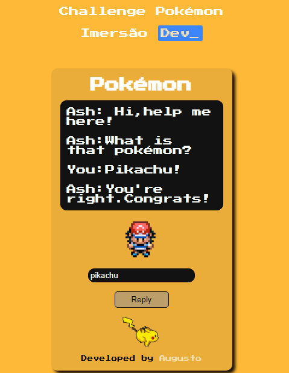
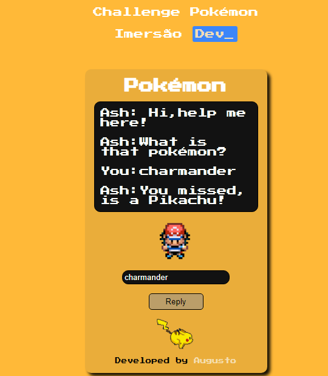

# Challenge-Pokemon 🥊
Hi, this was a second project from [Alura's](https://www.alura.com.br) workshop.
the challenge was make a site using front end , to show if the answer is
correct or not and change the image.

# Specifications 🧾
1. Fist , Ash will ask if you know the name of the pokémon.
2. Second, Depending on you answer will show a message.
3. Third, Will change the image and put the Pikachu's gif.

# Design 🖥️

# Design when you win 🏅

# Design when you lose😔

